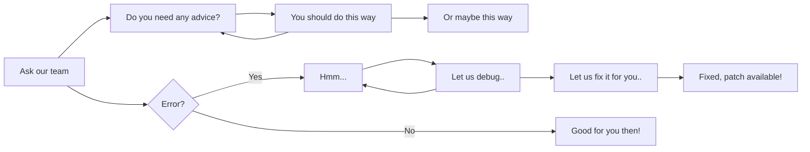

# General Information

Prodomo relies on ==cleanliness==, ==arrangement==, and of course YOU! Below you will find essential information about the Prodomo project and how YOU can be part of it. What are you waiting for?

!!! quote annotate 

    You will find most information and changelogs much easier on the (1)Prodomo discord!

1.  :woman_raising_hand: Don't forget to enter the discord server shown in the navigation bar!  :octicons-code-of-conduct-24:{ .heart }

## What does the project contain?

??? success "Visual presentation of the client"
    `last update: 28.7.2024`

    **Attention**! This video was recorded when the Prodomo project version was **5.3**. In the meantime, there is a chance that some changes may have occurred. Please consult the change log/test client.

    <div class="video-wrapper">
    <iframe width="1280" height="720" src="https://www.youtube.com/embed/Z3DSgCzS4To" frameborder="0" allowfullscreen></iframe>
    </div>


??? example "Server & Client Defines"
    **(!)** This may change in the future.
    
    `last update: 29.7.2024`
    === "Locale_inc.h"

        ``` c++
          #pragma once


          #define APP_TITLE "x64 prodomo files"

          #define DEFAULT_DEFINE_YMIR																	// Default define from Ymir;
          #define PRODOMO_VERSION_4																	// Prodomo server_files_v4 binary_locale_ext_23/7/2024/6:15PM
          #define PRODOMO_VERSION_5																	// Prodomo server_files_v5 binary_locale_ext_23/7/2024/6:15PM
          #define PRODOMO_FIX																			// Prodomo server_files_v5 binary_locale_ext_23/7/2024/6:15PM
          #define PRODOMO_LICENCE																		// licence active for user __ until __


          #ifdef DEFAULT_DEFINE_YMIR
          #define LOCALE_SERVICE_EUROPE																// __YM_Locale_Service__
          #define ENABLE_COSTUME_SYSTEM																//  __YM_Costume_System__
          #define ENABLE_ENERGY_SYSTEM																// __YM_Energy_System__
          #define ENABLE_DRAGON_SOUL_SYSTEM															// __YM_Dragon_Soul__
          #define ENABLE_NEW_EQUIPMENT_SYSTEM															// __YM_Equipment__
          #endif
          #ifdef PRODOMO_VERSION_4
          #define ENABLE_USE_COSTUME_ATTR																// __GF_Attr__
          #define ENABLE_SASH_SYSTEM																	// __GF_Sash&Acce_System__
          #define ENABLE_CHANGELOOK_SYSTEM															// __GF_Transmutation__
          #define ENABLE_QUEST_RENEWAL																// __GF_Quest_Renewal__
          #define ENABLE_QUEST_WIDTH_EXPANSION														// __GF_Quest_Width__
          #define ENABLE_CUBE_RENEWAL_WORLDARD														// __GF_Cube_Renewal__
          #define ENABLE_MINI_GAME																	// __GF_New_Minigames__
          #define ENABLE_FISH_EVENT																	// __GF_New_Minigames__
          #define ENABLE_GRAPHIC_ON_OFF																// __GF_Reversed_Settings__
          #define WJ_ENABLE_TRADABLE_ICON																// __GF_Tradable_Icon__
          #define __BL_ENABLE_PICKUP_ITEM_EFFECT__													// __GF_Pickup_Effect__
          #define __EXTENDED_SAFEBOX__																// __GF_Safebox__
          #define ENABLE_SPECIAL_INVENTORY_SYSTEM														// __Renewal_Special_Inventory__
          #define ENABLE_LVL115_ARMOR_EFFECT															// __GF_Armor_Effect__
          #define ENABLE_ATLAS_MARK_INFO																// __GF_Atlas_Mark__
          #define ENABLE_GF_ATLAS_MARK_INFO															// __GF_Atlas_Mark__
          #define ENABLE_STONE_ON_MINIMAP																//  __GF_Atlas_Mark__
          #define ENABLE_DETALII_RESCRISE																// __GF_View_Character_Bonuses__
          #define ENABLE_PACK_GET_CHECK																// __Renewal_Pack_Check__
          #define ENABLE_CANSEEHIDDENTHING_FOR_GM														// __Renewal_/inv__
          #define ENABLE_PROTOSTRUCT_AUTODETECT														// __Renewal_Items&Mobs_Proto__
          #define ENABLE_SLOT_WINDOW_EX																// __Renewal_Slot_Window__
          #define ENABLE_EXTENDED_SOCKETS																// __Renewal_6_slots_sockets__
          #define ENABLE_TOP_PLAYERS_EFFECT															// __Renewal_Top_Player_Effect__
          #define WJ_SHOW_MOB_INFO																	// __Show_Mob_Info__
          #ifdef WJ_SHOW_MOB_INFO																		// __Show_Mob_Info__
          #define ENABLE_SHOW_MOBAIFLAG																// __Show_Mob_Info__
          #define ENABLE_SHOW_MOBLEVEL																// __Show_Mob_Info__
          #define ENABLE_NEW_MODULE_CONFIG															// __GF_Config__
          #endif
          #define ENABLE_NEW_EXCHANGE_WINDOW															// __GF_Exchange_Window__
          #define ENABLE_FOV_OPTION																	// __GF_Fov__
          #define ENABLE_HIGH_LIGHT_IMAGE																// __GF_High_Light__
          #define ENABLE_SHOW_CHEST_DROP																// __Renewal_Show_Chest_Dropable_Items__
          #define ENABLE_MOVE_CHANNEL																	// __Renewal_Move_Channel(1&2&3&4)__
          #define ENABLE_SEND_TARGET_INFO																// __Renewal_Target_Info__
          #define ENABLE_VIEW_TARGET_PLAYER_HP														// __Renewal_Target_Info__
          #define ENABLE_VIEW_TARGET_DECIMAL_HP														// __Renewal_Target_Info__
          #define ENABLE_SEND_TARGET_INFO_EXTENDED													// __Renewal_Target_Info__
          #define ENABLE_REFINE_RENEWAL																// __Renewal_Refine__
          #define ENABLE_BIOLOGIST_RENEWAL_SYSTEM														// __Renewal_Biologist__
          #define ENABLE_MULTIFARM_BLOCK																// __Renewal_Hwid_MultiFarm_Block__
          #define ENABLE_ADVANCE_SKILL_SELECT															// __Renewal_Skill_Select_Window__
          #define OFFLINE_MESSAGE_REWORKED															// __Renewal_Offline_Messages__
          #define LINK_IN_CHAT																		// __Renewal_Chat__
          #define ENABLE_DAILY_GIFT_SYSTEM															// __Renewal_Daily_Gift__
          #define ENABLE_HIDE_COSTUME_SYSTEM															// __Renewal_Hide_Costume__
          #define RENEW_SCALE																			// __Renewal_Scale_Boss&Metin__
          #define __RENEWAL_NOTICE__																	// __Renewal_Notice__
          #define RENEWAL_PICKUP_AFFECT																// __Renewal_Pickup__
          #define ENABLE_MESSENGER_TEAM																// __Renewal_Messenger__
          #define ENABLE_RENEWAL_SHOPEX																// __Renewal_ShopEx__
          #define ENABLE_DISCORD_RPC																	// __Renewal__Discord_Rpc__
          #define ENABLE_REMOVE_LIMIT_GOLD															// __Unsigned_Long_Long_Limit_Gold__
          #define ENABLE_EFFECT_WINGS_NEW																// __Renewal_Mde_Mse_Wings__
          #define ENABLE_SHINING_SYSTEM																// __Renewal_Client_Shining__
          #define ENABLE_AFFECT_RENEWAL																//  __Reworked_Affect_Renewal__
          #define ENABLE_MOUNT_COSTUME_SYSTEM															// __Renewal_Mount_Costume__
          #define ENABLE_WEAPON_COSTUME_SYSTEM														// __Renewal_Weapon_Costume__
          #endif
          #ifdef PRODOMO_VERSION_5
          #define ENABLE_AURA_SYSTEM																	// __GF_Aura__
          #define ENABLE_ATTR_6TH_7TH																	// __GF_6&7_Attr__
          #define ENABLE_DRAGONSOUL_ALCHEMY_PLUS														// __GF_Mythic_Alchemy__
          #define ENABLE_REFINE_ELEMENT																// __GF_Refine_Element_Fire&Ice&Lightning&Darkness&Earth&Wind__
          #define ENABLE_PET_SLOT																		// __GF_Pet_Slot__
          #define ENABLE_CONQUEROR_LEVEL																// __GF_Conqueror(Level&Map&Attr&Items&Bonuses)__
          #define ENABLE_GLOVE_SYSTEM																	// __GF_Glove&Yohara__
          #define BONUS_PCT																			// __GF__Proto_New_Bonuses__
          #define NEW_BONUS																			// __GF_Metin&Boss_Bonus__
          #define ENABLE_EXTEND_INVEN_SYSTEM															// __GF_New_Inventory(3&4Blocked)__
          #define ENABLE_GAYA_SYSTEM																	// __GF_Gaya_System__
          #define ENABLE_EXTEND_INVEN_SYSTEM															// __GF_3&4_Blocked_Inventory__
          #define ENABLE_SHIP_DEFENSE																	// __GF_Hydra__
          #define VERSION_162_ENABLED																	// __GF_Meley_Lair__
          #define ENABLE_MELEY_LAIR_DUNGEON															//__GF_Meley_Lair__
          #ifdef ENABLE_MELEY_LAIR_DUNGEON															//__GF_Meley_Lair__
          #define MELEY_LAIR_DUNGEON_STATUE 6118														//__GF_Meley_Lair__
          #endif
          #define __NEW_SET_BONUS__																	// __GF_Costume&Sash&Aura&Item_BonusSet__
          #define ELEMENT_TARGET																		// __GF_17.5_ELEMENT_ON_TARGET__
          #define ENABLE_SHOW_LIDER_AND_GENERAL_GUILD													// __Show_Leader_Coleader_Guild_System__
          #define ENABLE_SHOW_LIDER_AND_GENERAL_GUILD_VALUE1 "Leader - "								// __Show_Leader_Coleader_Guild_System__
          #define ENABLE_SHOW_LIDER_AND_GENERAL_GUILD_VALUE2 "Co-Leader - "							// __Show_Leader_Coleader_Guild_System__
          #define ENABLE_PREMIUM_PLAYERS																// __Premium_System__
          #define __BL_MOUSE_WHEEL_TOP_WINDOW__														// __NEW PICK_UP_FILTER__
          #define __BL_CLIP_MASK__																	// __NEW PICK_UP_FILTER__
          #define ENABLE_MULTI_LANGUAGE_SYSTEM														// __Renewal_11Languages_MultiLanguage__
          #define ENABLE_EXTENDED_WHISPER_DETAILS														// __Renewal_11Languages_MultiLanguage__&&__Whisper_Details_For_MultiLanguage__
          #define LOCALE_STRING_RENEWAL																// __GF_Locale_String_Renewal&Adapted_for_MultiLanguage
          #define ENABLE_TEXT_LEVEL_REFRESH															// __Renewal_Buffi__
          #define ALIGN_SYSTEM_CUSTOM																	// __Renewal_Special_Align__
          #define ENABLE_GUILD_BONUSES																// __Renewal_Special_Guild_Bonuses__
          #define __AUTO_QUQUE_ATTACK__																// __Renewal_Auto_Metin_Farm__
          #define ENABLE_GLOBAL_CHAT																	// __Renewal_Global_Chat__
          #define ENABLE_SPECIAL_DROP_CHAT_RENEWAL
          #define ENABLE_7AND8TH_SKILLS
          #define ENABLE_MULTI_TEXTLINE																// Multi Text Line with \ntext
          #define ENABLE_EXPRESSING_EMOTION
          #define ENABLE_EMOTION_HIDE_WEAPON
          #define NEW_LOCALE																			// Reworked client_locale functions locale_game,locale_interface,item_proto,mob_proto,client_read
          #define __DUNGEON_INFO__																	// New _Dungeon_Info_ with notifications&hide_functions
          #define ENABLE_INVENTORY_PROTECTED_SYSTEM
          #define ENABLE_PREMIUM_PRIVATE_SHOP
          #ifdef ENABLE_PREMIUM_PRIVATE_SHOP
          #define ENABLE_PRIVATE_SHOP_PREMIUM_TIME
          //#define ENABLE_PRIVATE_SHOP_BUNDLE_REQ
          // #define ENABLE_PRIVATE_SHOP_CHEQUE
          #define ENABLE_PRIVATE_SHOP_LIMITED_DISTANCE_RENDERING
          //#define ENABLE_PRIVATE_SHOP_BUILD_LIMITATIONS
          #define ENABLE_PRIVATE_SHOP_LOCKED_SLOTS
          // #define ENABLE_PRIVATE_SHOP_PRICE_SORT
          #define ENABLE_PRIVATE_SHOP_TIME_SORT
          #define ENABLE_PRIVATE_SHOP_DIFFERENT_PRICE_RESTRICTION
          // #define ENABLE_PRIVATE_SHOP_CHANGE_LOOK
          // #define ENABLE_PRIVATE_SHOP_REFINE_ELEMENT
          // #define ENABLE_PRIVATE_SHOP_APPLY_RANDOM
          #endif
          #define ENABLE_SWITCHBOT
          #define ENABLE_EVENT_MANAGER
          #define __ENABLE_SHAMAN_SYSTEM__
          #ifdef __ENABLE_SHAMAN_SYSTEM__
          #define SHAMAN_MOB_VNUM 20114
          #endif
          #endif
          #ifdef PRODOMO_FIX
          #define heavyeffectfix																		// __Fix__
          #define FIX_UPDATE_LEVEL																	// __Fix__
          #define FIX_UPDATE_PLAYTIME_AND_ITEMS														// __Fix__
          #define FIX_CHAT_HISTORY_UPDATE																// __Fix__
          #define FIX_CONNECT																			// __Fix__
          #define FIX_DELETE_FRIEND_REFRESH															// __Fix__
          #define __ENABLE_STEALTH_FIX__																// __Fix__
          #define FIX_UNHANDLED_EMPTY_TEXTURESET														// __Fix__
          #define FIX_PLAYERS_LOAD																	// __Fix__
          #define ENABLE_FAST_DROP																	// __Fix__
          #define DISABLE_FONT_ITALIC_GM																// __Fix__
          #define ENABLE_MOVEMENT_FIX																	// __Fix__
          #define ENABLE_SOME_FIXES																	// __Fix__
          #define ENABLE_CLIENT_MEMORY_LEAK_AND_CPU_USAGE_FIX											// __Fix__
          #define ENABLE_ITEM_MOVE_FIX																// __Fix__
          #define ENABLE_ANTIFLAG_TOOLTIP																// __Fix__
          #endif

        
        ```
  
    === "ProdomoDefines.h"

		``` c++

			#ifndef __M2_PRODOMO_DEFINES__
			#define __M2_PRODOMO_DEFINES__
			
			//////////////////////////////////////////////////////////////////////////
			// ### General Features ###
			#define ENABLE_D_NJGUILD // __PSVF_Guild_Features__
			#define ENABLE_NEWSTUFF // new stuff from martysama
			#define ENABLE_PORT_SECURITY // new 3306 port security
			#define ENABLE_BELT_INVENTORY_EX // belt-inventory rework
			enum eCommonDefines {
				MAP_ALLOW_LIMIT = 32, // __PSVF_Map_Allow_Limit__
			};
			// ### General Features ###
			#define __SASH_SYSTEM__ // __GF Sash / Acce__
			#define __CHANGELOOK_SYSTEM__ // __GF Transmutation__
			#define __ENABLE_CHANGELOOK_SYSTEM__ // __GF Transmutation__
			#define __QUEST_RENEWAL__ // __GF_Quest_Renewal__
			#ifdef __QUEST_RENEWAL__
				#define _QR_MS_
			#endif
			#define ENABLE_CUBE_RENEWAL_WORLDARD // __GF_Cube_Renewal__
			#define __BL_ENABLE_PICKUP_ITEM_EFFECT__ // __GF_Pickup_SlotEffect__
			#define ENABLE_FISH_EVENT // __GF_JigSaw_Event__
			#define WJ_ENABLE_TRADABLE_ICON // __GF_Tradable_Icon__
			#define __NEW_EXCHANGE_WINDOW__ // __GF_Exchange_Window__
			#define ENABLE_DRAGONSOUL_ALCHEMY_PLUS // __GF_Mythic_Alchemy_Set_Bonus__
			#define ENABLE_REFINE_ELEMENT // __GF_Refine_Element_Fire&Ice&Lightning&Darkness&Earth&Wind__
			#define ENABLE_PET_COSTUME_SYSTEM // __GF_Pet_Slot__
			#define __AURA_SYSTEM__ // __GF_Aura__
			#define __ATTR_6TH_7TH__ // __GF_6&7Attr__
			#define LOCALE_STRING_RENEWAL // __GF_Locale_String_Renewal&Adapted_for_MultiLanguage
			#define __NEW_SET_BONUS__ // __GF_Costume&Sash&Aura&Item_BonusSet__
			// ### // __Reworked_Bonuses__ ####
			#define NEW_BONUS // __GF_Metin&Boss_Bonus__
			#define BONUS_PCT // __GF__Proto_New_Bonuses__
			// ### // __Reworked_Bonuses__ ####
			#define __SHIP_DEFENSE__ // __GF_Hydra_Dungeon__
			#define __VERSION_162__ // __GF_Hydra_Dungeon__
			#ifdef __VERSION_162__// __GF_Hydra_Dungeon__ 
				#define HEALING_SKILL_VNUM 265// __GF_Hydra_Dungeon__
			#endif
			#define __DUNGEON_FOR_GUILD__ // __GF_Meley_Lair__
			#ifdef __DUNGEON_FOR_GUILD__// __GF_Meley_Lair__
				#define __MELEY_LAIR_DUNGEON__// __GF_Meley_Lair__
				#ifdef __MELEY_LAIR_DUNGEON__// __GF_Meley_Lair__
					#define __DESTROY_INFINITE_STATUES_GM__// __GF_Meley_Lair__
					#define __LASER_EFFECT_ON_75HP__// __GF_Meley_Lair__
					#define __LASER_EFFECT_ON_50HP__// __GF_Meley_Lair__
				#endif
			#endif
			#define ENABLE_GAYA_SYSTEM // __GF_Gaya_System__
			#define __CONQUEROR_LEVEL__ // __GF_Conqueror(Level&Map&Attr&Items&Bonuses)__
			#define ENABLE_GLOVE_SYSTEM	// __GF_Glove&Yohara__
			#ifdef ENABLE_GLOVE_SYSTEM
				#define ENABLE_GLOVE_ITEM_ATTR	// __GF_ItemAttrTable_For_Gloves
			#endif
			#define ELEMENT_TARGET  //__GF_17.5_ELEMENT_ON_TARGET__
			// ### // __Reworked_Inventory__ ####
			#define ENABLE_EXTEND_INVEN_SYSTEM // __GF_Inventory__
			#define __EXTENDED_SAFEBOX__ // __GF_Safebox__
			#define ENABLE_EXTEND_INVEN_SYSTEM // __GF_3&4_Blocked_Inventory__
			#define __SPECIAL_INVENTORY_SYSTEM__ // new special-inventory system
			// ### // __Reworked_Inventory__ ####
			// ### General Features ###
			//////////////////////////////////////////////////////////////////////////
			// ### // __Reworked__ ####
			#define ENABLE_FLOOD_PRETECTION // __Fix__
			#define IS_FIX_POISON_RISIPA_AFFECT(type) ((type) == AFFECT_MOV_SPEED || (type) == AFFECT_ATT_SPEED || (type) == AFFECT_STR || (type) == AFFECT_DEX || (type) == AFFECT_INT || (type) == AFFECT_CON || (type) == AFFECT_CHINA_FIREWORK || (type) == SKILL_JEONGWI || (type) == SKILL_GEOMKYUNG || (type) == SKILL_CHUNKEON || (type) == SKILL_EUNHYUNG || (type) == SKILL_GYEONGGONG || (type) == SKILL_GWIGEOM || (type) == SKILL_TERROR || (type) == SKILL_JUMAGAP || (type) == SKILL_MANASHILED || (type) == SKILL_HOSIN || (type) == SKILL_REFLECT || (type) == SKILL_KWAESOK || (type) == SKILL_JEUNGRYEOK || (type) == SKILL_GICHEON) // __Fix__
			#define __FIX_CHANGE_SEX_WITHOUT_RELOG__ // __Fix__
			#define ENABLE_FLY_FIX // __Fix__
			#define ENABLE_EXTENDED_RELOAD // __Fix__
			#define ENABLE_BOSS_KICK_INTO_WALLS_FIX // __Fix__
			#define ENABLE_KICK_MULTI_IP_OX // __Fix__
			#define ENABLE_HEADER_100_FIX // __Fix__
			#define __FIX_UPDATE_LEVEL__ // __Fix__
			#define ENABLE_EXTENDED_SOCKETS // __Fix__
			#define __FIX_UPDATE_ALIGNMENT__ // __Fix__
			#define __FIX_COSTUM_NUNTA_PESTE_COSTUM_NORMAL__ // __Fix__
			#define FIX_BLOCK_MOB_SAFEZONE // __Fix__
			#define __FIX_BREASLA_LA_SCHIMBARE_REGAT__ // __Fix__
			#define __FIX_UPDATE_PLAYTIME_AND_ITEMS__ // __Fix__
			#define __FIX_DELETE_FRIEND_REFRESH__ // __Fix__
			#define __FIX_INFO_REFINE_DRAGONSOUL__ // __Fix__
			#define __FIX_DUNGEON_PARTY__ // __Fix__
			#define ENABLE_FIX_READ_ETC_DROP_ITEM_FILE_BY_VNUM // __Fix__
			#define __FIX_EXPLOIT_QUEST__ // __Fix__
			#define FLUSH_AT_SHUTDOWN // __Fix__
			#define FIX_SELECT_EMPIRE_PHASE // __Fix__
			#define __FIX_EXP_GRUP__ // __Fix__
			#define __FIX_ITEMS_TYPE_33__ // __Fix__
			#define __FIX_KICK_HACK__ // __Fix__
			#define ENABLE_COUNT_MONSTER_FIX // __Fix__
			#define ENABLE_DUNGEON_NOTICE_FIX // __Fix__
			#define FIX_LOAD_MOBS_WITH_MOUNT // __Fix__
			#define __FIX_NIVEL_CAL__ // __Fix__
			#define __FIX_PC_SELECT_QUEST__ // __Fix__
			#define ENABLE_FIX_QUICK_SLOT // __Fix__
			#define __FIX_SECONDARY_SKILL__ // __Fix__
			#define __FIX_TIMER_EVENT__ // __Fix__
			#define ENABLE_DESTROY_GUILD_IF_WAR_IS_ACTIVE_FIX // __Fix__
			#define __FIX_BUG_AURA_TAIS_FARA_ARMA__ // __Fix__
			#define __FIX_HP_GROUP__ // __Fix__
			#define __FIX_COMANDA_RAZBOI__ // __Fix__
			#define __FIX_CAMPFIRE__ // __Fix__
			#define __FIX_CAMPFIRE__SEC 60 // __Fix__
			#define __FIX_BUG_IMMUNE__ // __Fix__
			#define __FIX_CHANGE_SKILL_VISUAL_BUG__ // __Fix__
			#define FIX_DUNGEON_MUSIC // __Fix__
			#define POTIUNI_PERMANENTE_RELUCRATE // __Fix__
			#define FIX_STICLA_CUNOASTERII // __Fix__
			#define FIX_AURA_BUG_VIZUAL // __Fix__
			#define PRODOMO_EMOTIE_FIX // __Fix__
			#define PRODOMO_PIATRA_FIX // __Fix__
			#define PRODOMO_SOME_FIX // __Fix__
			#define lib_essex_prodomo // __Fix__
			#define ENABLE_WEDDING_FIX // __Fix__
			#define ENABLE_CLEAR_OLD_GUILDS_LANDS_BY_INACTIVITY // __Fix__
			#define ENABLE_UPDATE_LASTPLAY_REAL_TIME // __Fix__
			//////////////////////////////////////////////////////////////////////////
			// ### // __Reworked__ ####
			
			
			// __Top_System__
			
			#define ENABLE_TOP_PLAYERS_EFFECT
			#ifdef ENABLE_TOP_PLAYERS_EFFECT // __Top_Player_Effect__
				#define TOP_PLAYER_MAX_LEVEL 120 // __Top_Player_Effect__
			#endif
			#define ENABLE_SHOW_LIDER_AND_GENERAL_GUILD // __Leader&CoLeader_Show__
			#define __ENABLE_PREMIUM_PLAYERS__
			
			// ### Multi_Language Systems ###
			#define __MULTI_LANGUAGE_SYSTEM__ // __Renewal_11Languages_MultiLanguage__
			#define __EXTENDED_WHISPER_DETAILS__ // __Renewal_11Languages_MultiLanguage__&&__Whisper_Details_For_MultiLanguage__
			// ### Multi_Language Systems ###
			
			// ### CommonDefines Systems ###
			//////////////////////////////////////////////////////////////////////////
			#endif
			
			#define ENABLE_MOVE_CHANNEL // __Move_Channel_1&2&3&4__
			#define __SEND_TARGET_INFO__ // __Renewal_Target_Info
			#define __SORT_INVENTORY_ITEMS__ // __Sort_Inventory&Special_Inventory_Items__
			#define __VIEW_TARGET_PLAYER_HP__ // __Target_Info__
			#define __VIEW_TARGET_DECIMAL_HP__ // __Target_Info__
			#define ENABLE_SEND_TARGET_INFO_EXTENDED //__Target_Info__
			#define __DAILY_GIFT_SYSTEM__ /// __New_Daily_Gift__
			#define __ENABLE_BIOLOGIST_RENEWAL_SYSTEM__ // __Renewal_Biologist__
			#define PRODOMO_HIDE_COSTUME // __Renewal_Hide_System__
			#define ENABLE_MULTI_FARM_BLOCK // __Renewal_Hwid_Multi_Farm_Block__
			#define RENEWAL_PICKUP_AFFECT // __Renewal_PickUp_Instant__
			#define __GM_PE_N__ // __Renewal_n_GameMaster_Name__
			#define ENABLE_ITEMSHOP // __Renewal_InGame_ItemShop__
			#define ENABLE_ITEMSHOP_TO_INVENTORY // __Renewal_InGame_ItemShop__
			#define ENABLE_MESSENGER_TEAM // __Renewal_Friend_List
			#define ENABLE_RENEWAL_SHOPEX // __Renewal_ShopEx__
			#define ENABLE_REMOVE_LIMIT_GOLD // __Unsigned_Long_Long_Limit_Gold__
			#define ENABLE_AFFECT_RENEWAL // __Reworked_Affect_Renewal__
			#define __ENABLE_ADVANCE_SKILL_SELECT__ // __Renewal_Skill_Select__
			#define NEW_ATTR_RANFORSARI // __Renewal_Reinforcements__
			#define OFFLINE_MESSAGE_REWORKED // __Renewal_OfflineMessages__
			#define ENABLE_MOUNT_COSTUME_SYSTEM // __Renewal_Mount_Costume__
			#define ENABLE_WEAPON_COSTUME_SYSTEM //__Renewal_Weapon_Costume__
			#define __GUILD_BONUSES__ // __Renewal_Bonuses_For_Guild__
			#define __AUTO_QUQUE_ATTACK__ // __Renewal_Auto_Metin_Farm__
			#define __7AND8TH_SKILLS__ //
			#define ENABLE_NEW_PASSIVE_SKILL
			#define ENABLE_EXPRESSING_EMOTION
			#define __DUNGEON_INFO__
			#define __ENABLE_INVENTORY_PROTECTED_SYSTEM__
			#define ENABLE_GLOBAL_RANK
			#ifdef ENABLE_GLOBAL_RANK
				#define RANKGLOBAL_DB_SAVE_TIME (int)60*20
				#define RANKGLOBAL_DB_FLUSH_TIME (int)10
				#define RANKGLOBAL_DB_FLUSH_COUNT (int)2000
			#endif
			#define __PREMIUM_PRIVATE_SHOP__
			#ifdef __PREMIUM_PRIVATE_SHOP__
				#define ENABLE_PRIVATE_SHOP_PREMIUM_TIME
				// #define ENABLE_PRIVATE_SHOP_CHEQUE
				//#define ENABLE_PRIVATE_SHOP_BUNDLE_REQ
				//#define ENABLE_PRIVATE_SHOP_BUILD_LIMITATIONS
				// #define ENABLE_PRIVATE_SHOP_SPECIAL_INV
				// #define ENABLE_PRIVATE_SHOP_EXTEND_INV
				// #define ENABLE_PRIVATE_SHOP_EXTEND_SPECIAL_INV
				#define ENABLE_PRIVATE_SHOP_LOCKED_SLOTS
				// #define ENABLE_PRIVATE_SHOP_CHANGE_LOOK
				// #define ENABLE_PRIVATE_SHOP_REFINE_ELEMENT
				// #define ENABLE_PRIVATE_SHOP_APPLY_RANDOM
				// #define ENABLE_PRIVATE_SHOP_SOCKET5
			#endif
			#define ENABLE_SWITCHBOT
			#define __EVENT_MANAGER__
			#define __ENABLE_SHAMAN_SYSTEM__
			#define __PET_SYSTEM__
			#define __UDP_BLOCK__
			#define ENABLE_RENEWAL_SHOPEX
			#define __CASKET_PREVIEW_ENABLE__

		```

## How is the support provided?

Support for the Prodomo project is provided by our team **free of charge** during our **available** free time. This includes server installation, system installation (based on requirements and Terms of Service), information, and suggestions.



## Pricing & Info


> Be aware that this table may be modified in the future: `last update: 28.07.2024`.

| Features      | Description                          | Price
| :---------: | :----------------------------------: | :----------------------------------:
| Version **5** files       | Server&Client files, Server&Client source, Server&Client tools (decrypter, extractor)   | **600€** + :gift:{ .gift } 2 weeks of premium.[^1]
|  [Installation][installation]      | We assure you that both we and our partners are here to help you. Installations are {++free++}, both on the host and local. | :octicons-check-circle-24:{ .circle }  **Included**
| [Support][support]    | At Prodomo, we are dedicated to providing exceptional support to our valued clients. We offer {++free++} assistance within the limits of our staff's available time, ensuring that you receive the help you need without any additional cost. Our commitment to service includes complimentary fixes, updates, and even small systems that are provided and installed at {++no charge++}. Your satisfaction is our priority, and we strive to make your experience with Prodomo seamless and efficient. | :octicons-check-circle-24:{ .circle }  **Included**
| Updates    | Prodomo provides continuous updates free of charge to ensure the optimal performance of your server. We offer updates that cover both the technical functionality of the server and Quality of Life (QoL) improvements. | :octicons-check-circle-24:{ .circle }  **Included**
| [Reach][partners][^2]    | Prodomo helps you promote your server as well. Are you a Prodomo client with an online server that doesn’t use Prodomo-Files as its base? No problem, we allow you to promote your server without any issues. | :octicons-check-circle-24:{ .circle }  **Included**
| Protection[^3]    | Prodomo offers a wide range of protections that will safeguard you from any obstacles encountered in opening, running, or operating the server. | :octicons-check-circle-24:{ .circle }  **Included(BASE)**

[installation]: install-server.md
[support]: support.md

<center>

## Upgrades & modifications

</center>

<center>

| Features      |                           | Price
| :---------: | :----------------------------------: | :----------------------------------:
| Moving systems[^4] | :octicons-chevron-right-24: | **First time** free, then **10€ per system**
| Installing Systems[^5] | :octicons-chevron-right-24: | Price may **vary**


| Upgrade from Version      |     | Upgrade to version                      | Price
| :---------: | :----------------------------------: | :----------------------------------:| :----------------------------------:
| Version 4 | :octicons-chevron-right-24: | Version 5 | **150€**

</center>

<center>

[:link:Get our files](contact.md){ .md-button .md-button--primary }

</center>

[^1]:
    Premium provides access to resources available on a special channel. This channel is {++free++} for 2 weeks, after which access is blocked. Purchasing premium costs {++10 €++} per month and is used SOLELY for the maintenance of the website, server, and test client.

[^2]:
    Our :octicons-verified-24:{ .partners } [partners] and the Prodomo Discord server {==do not take responsibility for the advertising==} of your server by US or THEM (in the case of partners). The advertising will be carried out by {++you++}; we simply provide you with access to promote and increase your reach.

[partners]: partners.md


[^3]:
    Protection against floods and hackers is a STANDARD FEATURE included with {++BOTH++} versions of PRODOMO (version 4.0 and version 5.0). The P-GUARD protection is offered SEPARATELY, can be purchased ONLY FROM US, and is available for a single server per user. P-GUARD offers an advanced protection solution that can handle any issues.

[^4]:
    By moving systems, we refer to transferring them (gameplay, systems, QoL) from newer versions to older versions [e.g., moving a system from version 5.3 to 5.2]. The standard prices are only for systems; in the case of moving gameplay or QoL, prices may vary.

[^5]:
    By system installation, we refer to any kind of system, whether custom-created or not. Prices vary depending on the task's difficulty and our available free time. Generally, for systems that are easy to install or create, they can even be free of charge.

