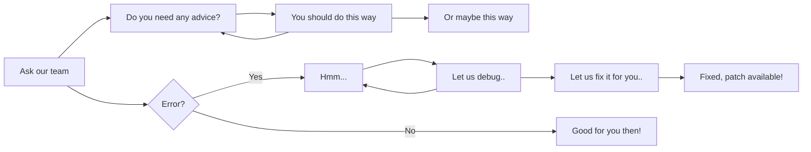

# General Information

Prodomo relies on ==cleanliness==, ==arrangement==, and of course YOU! Below you will find essential information about the Prodomo project and how YOU can be part of it. What are you waiting for?

!!! quote annotate "Join us!"

    You will find most information and changelogs much easier on the (1)Prodomo discord!

1.  :woman_raising_hand: Don't forget to enter the discord server shown in the navigation bar!  :octicons-code-of-conduct-24:{ .heart }

## What does the project contain?

??? success "Visual presentation of the client"
    `last update: 26.8.2024`

    **Attention**! This video was recorded when the Prodomo project version was **5.3.0**. In the meantime, there is a chance that some changes may have occurred. Please consult the change log/test client.

	> Video will be available in a few days!


??? example "Server & Client Defines"
    **(!)** This may change in the future.
    
    `last update: 26.8.2024`
    === "Locale_inc.h"

        ``` c++
		#pragma once
		
		
		#define APP_TITLE "PDFiles"
		
		#define DEFAULT_DEFINE_YMIR																	//@@ Default define from Ymir;
		#define PRODOMO_VERSION_4																	//@@ Prodomo server_files_v4 binary_locale_ext_1/8/2024/22:00PM
		#define PRODOMO_VERSION_5																	//@@ Prodomo server_files_v5 binary_locale_ext_1/8/2024/22:00PM
		#define PRODOMO_FIX																			//@@ Prodomo server_files_v5 binary_locale_ext_1/8/2024/22:00PM
		#define PRODOMO_LICENCE																		//@@ licence active for user __ until __
		
		
		
		#ifdef DEFAULT_DEFINE_YMIR
		#define LOCALE_SERVICE_EUROPE																//@@ ymir clasic locale service europe..
		#define ENABLE_COSTUME_SYSTEM																//@@ ymir clasic costume system..
		#define ENABLE_ENERGY_SYSTEM																//@@ ymir clasic energy system..
		#define ENABLE_DRAGON_SOUL_SYSTEM															//@@ ymir clasic legendary alchemy system..
		#define ENABLE_NEW_EQUIPMENT_SYSTEM															//@@ ymir refactorized equipment
		#endif
		
		
		#ifdef PRODOMO_VERSION_4
		#define ENABLE_USE_COSTUME_ATTR																//@@ refactorized attribute (add&change) for costume(weapon, head, body)
		#define ENABLE_SASH_SYSTEM																	//@@ gf acce&sash system with new absorbtion method
		#define ENABLE_CHANGELOOK_SYSTEM															//@@ gf transmutation system adapted for offlineshop & shopex
		#define ENABLE_QUEST_RENEWAL																//@@ gf quest renewal with automatic refresh
		#define ENABLE_QUEST_WIDTH_EXPANSION														//@@ gf quest width fixed for next/prev buttons
		#define ENABLE_CUBE_RENEWAL_WORLDARD														//@@ gf cube renewal adapted for moving attr & cheque & gaya
		#define ENABLE_MINI_GAME																	//@@ gf official minigames (Fish, Rumy, World Boss, Catch the King, etc..)
		#define ENABLE_FISH_EVENT																	//@@ gf official fish minigame 
		#define ENABLE_GRAPHIC_ON_OFF																//@@ gf official option settings (shadows, effects, etc..)
		#define WJ_ENABLE_TRADABLE_ICON																//@@ gf reversed tradable icon
		#define __BL_ENABLE_PICKUP_ITEM_EFFECT__													//@@ gf reversed ActivateSlot function renewal (Flash, New Colours)
		#define __EXTENDED_SAFEBOX__																//@@ gf reversed 6 pages slots for SafeBox, ItemShop.
		#define ENABLE_LVL115_ARMOR_EFFECT															//@@ gf reversed 115 armour thunder effect
		#define ENABLE_ATLAS_MARK_INFO																//@@ gf related Atlas Mark Renewal (1)
		#define ENABLE_GF_ATLAS_MARK_INFO															//@@ gf related Atlas Mark Renewal (2)
		#define ENABLE_STONE_ON_MINIMAP																//@@ gf related Atlas Mark Renewal (3)
		#define ENABLE_DETALII_RESCRISE																//@@ gf reversed show character bonus info
		#define ENABLE_PACK_GET_CHECK																//@@ gf reversed pack check
		#define ENABLE_CANSEEHIDDENTHING_FOR_GM														//@@ gf related renewal & refac /invsible for Game Master
		#define ENABLE_PROTOSTRUCT_AUTODETECT														//@@ gf related auto detection of proto (item&mob) structure
		#define ENABLE_SLOT_WINDOW_EX																//@@ gf reversed slot window (adapted for InventoryWindowEx)
		#define ENABLE_EXTENDED_SOCKETS																//@@ refactor 6 sockets for stones (by default 3)
		#define ENABLE_TOP_PLAYERS_EFFECT															//@@ renewal effects (Battle Zone) for top players (1, 2, 3) -> those who achieve max level
		#define WJ_SHOW_MOB_INFO																	//@@ gf related mob info (level, target, bonus) [1]
		#ifdef WJ_SHOW_MOB_INFO																		//@@ gf related mob info (level, target, bonus) [2]
		#define ENABLE_SHOW_MOBAIFLAG																//@@ gf related mob info (level, target, bonus) [3]
		#define ENABLE_SHOW_MOBLEVEL																//@@ gf related mob info (level, target, bonus) [4]
		#define ENABLE_NEW_MODULE_CONFIG															//@@ gf related config.exe adapted for multi language
		#endif
		#define ENABLE_NEW_EXCHANGE_WINDOW															//@@ gf related new exchange window
		#define ENABLE_FOV_OPTION																	//@@ renewal Field Of View option where you can set your POV in-game.
		#define ENABLE_HIGH_LIGHT_IMAGE																//@@ renewal highlight image inside quest & system function
		#define ENABLE_MOVE_CHANNEL																	//@@ renewal channel change adapted for new optimisation -> you will cannot use your inventory while you're teleporting & changing channel (p2p transfer still available)
		#define ENABLE_SEND_TARGET_INFO																//@@ renewal target info for players (Bonus, Target, new HP info) [1]
		#define ENABLE_VIEW_TARGET_PLAYER_HP														//@@ renewal target info for players (Bonus, Target, new HP info) [2]
		#define ENABLE_VIEW_TARGET_DECIMAL_HP														//@@ renewal target info for players (Bonus, Target, new HP info) [3]
		#define ENABLE_SEND_TARGET_INFO_EXTENDED													//@@ renewal target info for players (Bonus, Target, new HP info) [4]
		#define ENABLE_BIOLOGIST_RENEWAL_SYSTEM														//@@ renewal biologist missions & system -> New UI, more easy to configure new missions & bonuses & items for completing the mission. ([!] Still moving it to .xml) 
		#define ENABLE_MULTIFARM_BLOCK																//@@ renewal multi farm block based on HWID, 3 accounts max for farm & fish & mining
		#define ENABLE_ADVANCE_SKILL_SELECT															//@@ renewal and easy to use skill select, no quest needed.
		#define OFFLINE_MESSAGE_REWORKED															//@@ renewal offline messages stored for up to 7 days, cached and safe
		#define LINK_IN_CHAT																		//@@ renewal link in chat -> Adapted for auxiliary ctrl+x, select, copy, paste.
		#define ENABLE_DAILY_GIFT_SYSTEM															//@@ Author:__OWSAP__, new daily gift, automatic renewal after 7 days
		#define ENABLE_HIDE_COSTUME_SYSTEM															//@@ renewal hide costume for costume body, costume hair, costume weapon, costume acce&sash, costume aura
		#define RENEW_SCALE																			//@@ renewal scaling for Mounts & Pets & Metin Stones & Bosses & Effects.
		#define __RENEWAL_NOTICE__																	//@@ renewal animation for notice, full_notice, b_notice.
		#define RENEWAL_PICKUP_AFFECT																//@@ renewal pickup affect with settings for premium & nonpremium users.
		#define ENABLE_MESSENGER_TEAM																//@@ renewal notification for game master available.
		#define ENABLE_RENEWAL_SHOPEX																//@@ renewal shop ex with 4 tabs (E.G: Items needed to buy Sword+0 -> 4x White pearl, 4x Blue pearl, 4x Red pearl + 100.000 yang)
		#define ENABLE_DISCORD_RPC																	//@@ renewal discord rpc
		#define ENABLE_REMOVE_LIMIT_GOLD															//@@ new method for removing the 2.000.000.000 yang -> uint32_t (unsigned long long)
		#define ENABLE_EFFECT_WINGS_NEW																//@@ new method for reading the .mse and .mde wings
		#define ENABLE_SHINING_SYSTEM																//@@ new method for loading the shinings for weapons & armours (client only)
		#define ENABLE_AFFECT_RENEWAL																//@@ new method for storing & loading the affects
		#define ENABLE_MOUNT_COSTUME_SYSTEM															//@@ renewal mount costume (proto)
		#define ENABLE_WEAPON_COSTUME_SYSTEM														//@@ renewal weapon costume (proto)
		#endif
		
		#ifdef PRODOMO_VERSION_5
		#define ENABLE_AURA_SYSTEM																	//@@ Author:__P3NG3R__, reversed aura system
		#define ENABLE_ATTR_6TH_7TH																	//@@ reversed 6&7 attr system adapted for talisman & gloves
		#define ENABLE_DRAGONSOUL_ALCHEMY_PLUS														//@@ reversed mythic alchemy with new table
		#define ENABLE_REFINE_ELEMENT																//@@ reversed refine element for weapons (Wind, Lightning, Earth, Darkness and Fire)
		#define ENABLE_PET_SLOT																		//@@ reversed pet slot with active slot effect
		#define ENABLE_CONQUEROR_LEVEL																//@@ reversed Yohara expansion (Level, Dungeons, Bonuses, Character Development[Weapons, Armours, Gloves, Misc.], Maps, etc..)
		#define ENABLE_GLOVE_SYSTEM																	//@@ reversed Yohara expansion (Level, Dungeons, Bonuses, Character Development[Weapons, Armours, Gloves, Misc.], Maps, etc..)
		#define BONUS_PCT																			//@@ reversed Yohara expansion (Level, Dungeons, Bonuses, Character Development[Weapons, Armours, Gloves, Misc.], Maps, etc..)
		#define NEW_BONUS																			//@@ reversed Yohara expansion (Level, Dungeons, Bonuses, Character Development[Weapons, Armours, Gloves, Misc.], Maps, etc..)
		#define ENABLE_EXTEND_INVEN_SYSTEM															//@@ reversed official inventory (2 slots available, 3&4 blocked.)
		#define ENABLE_GAYA_SYSTEM																	//@@ reversed gaya system with automatic renewal
		#define ENABLE_SHIP_DEFENSE																	//@@ [Dungeon related]: o Hydra dungeon
		#define VERSION_162_ENABLED																	//@@ [Dungeon related]: o Meley dungeon[1]
		#define ENABLE_MELEY_LAIR_DUNGEON															//@@ [Dungeon related]: o Meley dungeon[2]
		#ifdef ENABLE_MELEY_LAIR_DUNGEON															//@@ [Dungeon related]: o Meley dungeon[3]
		#define MELEY_LAIR_DUNGEON_STATUE 6118														//@@ [Dungeon related]: o Meley dungeon[4]
		#endif
		#define __NEW_SET_BONUS__																	//@@ reversed set bonus (https://ro-wiki.metin2.gameforge.com/index.php/Set_Bonus)
		#define ELEMENT_TARGET																		//@@ reversed 17.5 element on target (Wind, Lightining, Fire, Ice)
		#define ENABLE_SHOW_LIDER_AND_GENERAL_GUILD													//@@ related for guild, this will show the leader & coleader[1]
		#define ENABLE_SHOW_LIDER_AND_GENERAL_GUILD_VALUE1 "Leader - "								//@@ related for guild, this will show the leader & coleader[2]
		#define ENABLE_SHOW_LIDER_AND_GENERAL_GUILD_VALUE2 "Co-Leader - "							//@@ related for guild, this will show the leader & coleader[3]
		#define ENABLE_PREMIUM_PLAYERS																//@@ renewal premium system with image tag, new bonuses and new features available for premium players
		#define __BL_MOUSE_WHEEL_TOP_WINDOW__														//@@ Author:__blackdragonx61__, mouse scroll function
		#define __BL_CLIP_MASK__																	//@@ Author:__blackdragonx61__, smooth mouse scroll function
		#define ENABLE_MULTI_LANGUAGE_SYSTEM														//@@ refactorized multi language made with new c++20 functions (transl. is loaded from client)
		#define LOCALE_STRING_RENEWAL																//@@ Author:blackdragonx61, reversed locale string reading adapted for multi language (locale interface, locale game, locale string, locale quiz, locale ox ->l from client)
		#define ENABLE_TEXT_LEVEL_REFRESH															//@@ refactorized and adapted for shaman support, now the text (not only the level) is inst. refreshing
		#define ALIGN_SYSTEM_CUSTOM																	//@@ renewal bonus for align (When you achieve 1.000, 2.000, 5.000, 10.000, 20.000 +/- align points you will receive a bonus / curse)
		#define ENABLE_GUILD_BONUSES																//@@ renewal bonus for guilds (When you achieve a certain guild level every member will receive a special bonus)
		#define ENABLE_GLOBAL_CHAT																	//@@ related to chat, now you will see language flag, empire flag, PM option in every shout / message typed in chat.
		#define ENABLE_7AND8TH_SKILLS                                                               //@@ related to skills, now you can choose between 2 passive skills (gf like)
		#define ENABLE_MULTI_TEXTLINE																//@@ \n text line
		#define ENABLE_EXPRESSING_EMOTION                                                           //@@ reversed emotions
		#define ENABLE_EMOTION_HIDE_WEAPON                                                          //@@ related to emotions, now your weapon will be hided when you emote
		#define NEW_LOCALE																		    //@@ related to multi language and new locale now the locale folder is more arranged and clean -> translations are renamed by their language (locale_interface-> ro.txt, en.txt, it.txt, etc..)
		#define __DUNGEON_INFO__																	//@@ renewal dungeon information window with test dungeon, shop dungeon, hide dungeon, arrange dungeons.
		#define ENABLE_INVENTORY_PROTECTED_SYSTEM                                                   //@@ related to inventory, this is a new protection made for your character, whenever your IP changes or a new connection is made your inventory is automaticaly blocked (basic password for your inventory is 999999 but you can change it in-game).
		
		#define ENABLE_PREMIUM_PRIVATE_SHOP                                                         //@@ renewal & rewritten offlineshop system[1]
		#ifdef ENABLE_PREMIUM_PRIVATE_SHOP                                                          //@@ renewal & rewritten offlineshop system[2]
		#define ENABLE_PRIVATE_SHOP_PREMIUM_TIME                                                    //@@ related to offlineshop time, when you activate premium your offlineshop will last for 7 days offline
		#define ENABLE_PRIVATE_SHOP_LIMITED_DISTANCE_RENDERING                                      //@@ related to optimisation, now the shops will render in a certain area
		#define ENABLE_PRIVATE_SHOP_LOCKED_SLOTS                                                    //@@ related to offlineshop slots, only the first page is unlocked, if you want to unlock the second page you will need a certain amount of keys
		#define ENABLE_PRIVATE_SHOP_TIME_SORT                                                       //@@ related to offlineshop time the search shop will not filter and sort items.
		#define ENABLE_PRIVATE_SHOP_DIFFERENT_PRICE_RESTRICTION                                     //@@ related to offlineshop economy you will cannot sell 90% below the market price.
		//@@ (ENABLE_PRIVATE_SHOP_BUNDLE_REQ):                                                      //@@ related to shop decoration, without a kashmere bundle you will cannot decorate your shop
		//@@ (ENABLE_PRIVATE_SHOP_CHEQUE):                                                          //@@ related to shop currency now you can trade Chequue(WON)
		//@@ (ENABLE_PRIVATE_SHOP_PRICE_SORT):                                                      //@@ related to shop currency with this setting the search-shop will sort the items by their price (lowest-highest)
		//@@ (ENABLE_PRIVATE_SHOP_BUILD_LIMITATIONS):                                               //@@ related to shop build, with this setting you will cannot open a shop in another empire, map
		//@@ (ENABLE_PRIVATE_SHOP_CHANGE_LOOK):                                                     //@@ related to shop items, this setting will adapt your offlineshop system for change_look system
		//@@ (ENABLE_PRIVATE_SHOP_REFINE_ELEMENT):                                                  //@@ related to shop items, this setting will adapt your offlineshop system for refine_element system
		//@@ (ENABLE_PRIVATE_SHOP_APPLY_RANDOM):                                                    //@@ related to shop items, this setting will adapt your offlineshop system for apply_random system
		#endif
		
		#define ENABLE_SWITCHBOT                                                                    //@@ renewal switchbot adapted for premium users, with only 3/5 unlocked slots, 5/5 for premium users, normal changing speed for generic users, faster changing speed for premium users
		#define ENABLE_EVENT_MANAGER                                                                //@@ renewal event manager with new events (Experience Event, Item_Drop Event, Boss Event, Metin Event, Mining Event, Gold_Frog Event, Moonlight Event, Hexagonal Chest Event, Fishing Event, Hide and Seek Evennt, OX Event, Tanaka Event, War between Kingdoms Event)
		#define __ENABLE_SHAMAN_SYSTEM__                                                            //@@ renewal & rewritten shaman support system adapted for premium with 4/6 skills available, 6/6 for premium users ([!]Still in development: Shaman Support Costume, Shaman Support Skill Color)
		#ifdef __ENABLE_SHAMAN_SYSTEM__                                                             //@@ renewal & rewritten shaman support system adapted for premium with 4/6 skills available, 6/6 for premium users ([!]Still in development: Shaman Support Costume, Shaman Support Skill Color)
		#define SHAMAN_MOB_VNUM 20114                                                               //@@ renewal & rewritten shaman support system adapted for premium with 4/6 skills available, 6/6 for premium users ([!]Still in development: Shaman Support Costume, Shaman Support Skill Color)
		#endif
		#define ENABLE_BATTLE_PASS                                                                  //@@ renewal & rewritten battlepass system with new UI and new functions for premium & normal users, easy to configure and set
		#define ENABLE_WORLD_BOSS_EVENT                                                             //@@ reversed world boss event easy to configure boss VNUM, map INDEX, spawn rate and awards
		#define ENABLE_CUSTOM_INVENTORY                                                             //@@ rewritten special inventory with new slots and new functions (Chests, Books, Stones, Special Items, Wardrobe, Safebox&Itemshop), (Fast move from special inventory to inventory, fast equip, fast delete, etc..)
		#define ENABLE_ACHIEVEMENT_SYSTEM                                                           //@@ rewritten & renewal achievement system, operates in XML, making it extremely easy to use and modify. You have a multitude of quests to complete throughout your progression on the server. The title system is integrated into the achievement system. By completing certain achievements, you will unlock titles for your character.
		#define REFACTOR_MULTIREFINE                                                                //@@ renewal multi refine, this system is designed in such a way that it does not disrupt the market nor render the crafting system obsolete. The Multi Refine system aims to improve both the design and functionality of the classic refining system.
		#endif
		
		
		
		#ifdef PRODOMO_FIX
		#define heavyeffectfix																		//@@fixme001;
		#define FIX_UPDATE_LEVEL																	//@@fixme002;
		#define FIX_UPDATE_PLAYTIME_AND_ITEMS														//@@fixme003;
		#define FIX_CHAT_HISTORY_UPDATE																//@@fixme004;
		#define FIX_CONNECT																			//@@fixme005;
		#define FIX_DELETE_FRIEND_REFRESH															//@@fixme006;
		#define __ENABLE_STEALTH_FIX__																//@@fixme007;
		#define FIX_UNHANDLED_EMPTY_TEXTURESET														//@@fixme008;
		#define FIX_PLAYERS_LOAD																	//@@fixme009;
		#define ENABLE_FAST_DROP																	//@@fixme010;
		#define DISABLE_FONT_ITALIC_GM																//@@fixme011;
		#define ENABLE_MOVEMENT_FIX																	//@@fixme012;
		#define ENABLE_SOME_FIXES																	//@@fixme013;
		#define ENABLE_CLIENT_MEMORY_LEAK_AND_CPU_USAGE_FIX											//@@fixme014;
		#define ENABLE_ITEM_MOVE_FIX																//@@fixme015;
		#define ENABLE_ANTIFLAG_TOOLTIP																//@@fixme016;
		#endif
		//@@fixmme017; be aware that 90% of source fixes are not available in define, they are already installed in pdfiles binary & server source.

        
        ```
  
    === "ProdomoDefines.h"

		``` c++

			#ifndef __M2_PRODOMO_DEFINES__
			#define __M2_PRODOMO_DEFINES__
			
			
			#define PRODOMO_VERSION_4																	//@@ Prodomo server_files_v4 binary_locale_ext_1/8/2024/22:00PM
			#define PRODOMO_VERSION_5																	//@@ Prodomo server_files_v5 binary_locale_ext_1/8/2024/22:00PM
			#define PRODOMO_FIX																			//@@ Prodomo server_files_v5 binary_locale_ext_1/8/2024/22:00PM
			#define PRODOMO_LICENCE																		//@@ licence active for user __ until __
			
			
			#ifdef PRODOMO_VERSION_5
			#define __PREMIUM_PRIVATE_SHOP__ //@@ renewal & rewritten offlineshop system[1]
			#ifdef __PREMIUM_PRIVATE_SHOP__ //@@ renewal & rewritten offlineshop system[2]
				#define ENABLE_PRIVATE_SHOP_PREMIUM_TIME //@@ related to offlineshop time, when you activate premium your offlineshop will last for 7 days offline
				#define ENABLE_PRIVATE_SHOP_LOCKED_SLOTS
			//@@ (ENABLE_PRIVATE_SHOP_CHEQUE):                                                          //@@ related to shop currency now you can trade Chequue(WON)
			//@@ (ENABLE_PRIVATE_SHOP_BUNDLE_REQ):                                                      //@@ related to shop decoration, without a kashmere bundle you will cannot decorate your shop
			//@@ (ENABLE_PRIVATE_SHOP_BUILD_LIMITATIONS):                                               //@@ related to shop build, with this setting you will cannot open a shop in another empire, map
			//@@ (ENABLE_PRIVATE_SHOP_CHANGE_LOOK):                                                     //@@ related to shop items, this setting will adapt your offlineshop system for change_look system
			//@@ (ENABLE_PRIVATE_SHOP_REFINE_ELEMENT):                                                  //@@ related to shop items, this setting will adapt your offlineshop system for refine_element system
			//@@ (ENABLE_PRIVATE_SHOP_APPLY_RANDOM):                                                    //@@ related to shop items, this setting will adapt your offlineshop system for apply_random system
			//@@ (ENABLE_PRIVATE_SHOP_SOCKET5): 														//@@ related to shop items, this setting will adapt your offlineshop system for 5/6 sockets for weapon stones (basic 3)
			#endif
			#define ENABLE_GLOBAL_RANK //@@ rewritten global ranking with 3 categories - monsters, bosses, metin stones
			#ifdef ENABLE_GLOBAL_RANK //@@ rewritten global ranking with 3 categories - monsters, bosses, metin stones [1]
				#define RANKGLOBAL_DB_SAVE_TIME (int)60*20 //@@ related to global ranking, here you can set save, flush and reset time for global ranking [2]
				#define RANKGLOBAL_DB_FLUSH_TIME (int)10 //@@ related to global ranking, here you can set save, flush and reset time for global ranking [3]
				#define RANKGLOBAL_DB_FLUSH_COUNT (int)2000 //@@ related to global ranking, here you can set save, flush and reset time for global ranking [4]
			#endif
			#define __DUNGEON_FOR_GUILD__ //@@; [Dungeon related]: o Meley dungeon(https://en-wiki.metin2.gameforge.com/index.php/Meley%27s_Lair_(Guild))[1]
			#ifdef __DUNGEON_FOR_GUILD__//@@; [Dungeon related]: o Meley dungeon(https://en-wiki.metin2.gameforge.com/index.php/Meley%27s_Lair_(Guild))[2]
				#define __MELEY_LAIR_DUNGEON__//@@; [Dungeon related]: o Meley dungeon(https://en-wiki.metin2.gameforge.com/index.php/Meley%27s_Lair_(Guild))[3]
				#ifdef __MELEY_LAIR_DUNGEON__//@@; [Dungeon related]: o Meley dungeon(https://en-wiki.metin2.gameforge.com/index.php/Meley%27s_Lair_(Guild))[4]
					#define __DESTROY_INFINITE_STATUES_GM__//@@; [Dungeon related]: o Meley dungeon(https://en-wiki.metin2.gameforge.com/index.php/Meley%27s_Lair_(Guild))[5]
					#define __LASER_EFFECT_ON_75HP__//@@; [Dungeon related]: o Meley dungeon(https://en-wiki.metin2.gameforge.com/index.php/Meley%27s_Lair_(Guild))[6]
					#define __LASER_EFFECT_ON_50HP__//@@; [Dungeon related]: o Meley dungeon(https://en-wiki.metin2.gameforge.com/index.php/Meley%27s_Lair_(Guild))[7]
				#endif
			#endif
			#define __SHIP_DEFENSE__ //@@; [Dungeon related]: o Hydra dungeon(https://en-wiki.metin2.gameforge.com/index.php/Ship_Defence)[1]
			#define __VERSION_162__ //@@; [Dungeon related]: o Hydra dungeon(https://en-wiki.metin2.gameforge.com/index.php/Ship_Defence)[2]
			#ifdef __VERSION_162__//@@; [Dungeon related]: o Hydra dungeon(https://en-wiki.metin2.gameforge.com/index.php/Ship_Defence)[3]
				#define HEALING_SKILL_VNUM 265//@@; [Dungeon related]: o Hydra dungeon(https://en-wiki.metin2.gameforge.com/index.php/Ship_Defence)[4]
			#endif
			#define __CONQUEROR_LEVEL__ //@@; reversed Yohara expansion (Level, Dungeons, Bonuses, Character Development[Weapons, Armours, Gloves, Misc.], Maps, etc..)[1]
			#define ENABLE_GLOVE_SYSTEM	//@@; reversed Yohara expansion (https://en-wiki.metin2.gameforge.com/index.php/Gloves)[2]
			#ifdef ENABLE_GLOVE_SYSTEM //@@; reversed Yohara expansion (https://en-wiki.metin2.gameforge.com/index.php/Gloves)[3]
				#define ENABLE_GLOVE_ITEM_ATTR //@@; reversed Yohara expansion (https://en-wiki.metin2.gameforge.com/index.php/Gloves)[4]
			#endif
			#define NEW_BONUS //@@; reversed Yohara expansion (Level, Dungeons, Bonuses, Character Development[Weapons, Armours, Gloves, Misc.], Maps, etc..)[5]
			#define BONUS_PCT //@@; reversed Yohara expansion (Level, Dungeons, Bonuses, Character Development[Weapons, Armours, Gloves, Misc.], Maps, etc..)[6]
			#define ENABLE_TOP_PLAYERS_EFFECT //@@; renewal effects (Battle Zone) for top players (1, 2, 3) -> those who achieve max level[1]
			#ifdef ENABLE_TOP_PLAYERS_EFFECT //@@; renewal effects (Battle Zone) for top players (1, 2, 3) -> those who achieve max level[2]
				#define TOP_PLAYER_MAX_LEVEL 120 //@@; renewal effects (Battle Zone) for top players (1, 2, 3) -> those who achieve max level[3]
			#endif
			#define __AURA_SYSTEM__ //@@; Author:__P3NG3R__, reversed aura system(https://en-wiki.metin2.gameforge.com/index.php/Aura_Outfit_System)
			#define __ATTR_6TH_7TH__ //@@; reversed 6&7 attr system adapted for talisman & gloves(https://en-wiki.metin2.gameforge.com/index.php/Bonuses)
			#define __NEW_SET_BONUS__ //@@; reversed set bonus (https://ro-wiki.metin2.gameforge.com/index.php/Set_Bonus)
			#define ENABLE_GAYA_SYSTEM //@@; reversed gaya system(https://en-wiki.metin2.gameforge.com/index.php/Gaya_System)
			#define __7AND8TH_SKILLS__ //@@ related to skills, now you can choose between 2 passive skills (https://en-wiki.metin2.gameforge.com/index.php/Category:Skills)
			#define ENABLE_EXPRESSING_EMOTION //@@; reversed emotions (https://en-wiki.metin2.gameforge.com/index.php/Emotions)
			#define __WORLD_BOSS_EVENT__ //@@ reversed world boss event easy to configure boss VNUM, map INDEX, spawn rate and awards (https://board.en.metin2.gameforge.com/index.php?thread/98745-the-world-boss-event/)
			#define LOCALE_STRING_RENEWAL //@@; Author:blackdragonx61, reversed locale string reading adapted for multi language (locale interface, locale game, locale string, locale quiz, locale ox ->l from client)
			#define __MULTI_LANGUAGE_SYSTEM__ //@@; refactorized multi language made with new c++20 functions (transl. is loaded from client)
			#define ELEMENT_TARGET  //@@; reversed 17.5 element on target (Wind, Lightining, Fire, Ice)
			#define ENABLE_EXTEND_INVEN_SYSTEM //@@; reversed official inventory (2 slots available, 3&4 blocked.)
			#define ENABLE_SHOW_LIDER_AND_GENERAL_GUILD //@@; related for guild, this will show the leader & coleader[1]
			#define __ENABLE_PREMIUM_PLAYERS__ //@@; renewal premium system with image tag, new bonuses and new features available for premium players
			#define ENABLE_DRAGONSOUL_ALCHEMY_PLUS //@@; reversed mythic alchemy with new table + set bonus for full alchemy
			#define ENABLE_REFINE_ELEMENT //@@; reversed refine element for weapons (Wind, Lightning, Earth, Darkness and Fire)
			#define ENABLE_PET_COSTUME_SYSTEM //@@; gf related pet slot with activation slot window
			#define ENABLE_MOVE_CHANNEL //@@; renewal channel change adapted for new optimisation -> you will cannot use your inventory while you're teleporting & changing channel (p2p transfer still available)
			#define __SEND_TARGET_INFO__ //@@; renewal target info for players (Bonus, Target, new HP info) [1]
			#define __VIEW_TARGET_PLAYER_HP__ //@@; renewal target info for players (Bonus, Target, new HP info) [2]
			#define __VIEW_TARGET_DECIMAL_HP__ //@@; renewal target info for players (Bonus, Target, new HP info) [3]
			#define ENABLE_SEND_TARGET_INFO_EXTENDED //@@; renewal target info for players (Bonus, Target, new HP info) [4]
			#define __SORT_INVENTORY_ITEMS__ //@@; general sort inventory available for inventory & special inventory
			#define __DAILY_GIFT_SYSTEM__ //@@; Author:__OWSAP__, new daily gift, automatic renewal after 7 days
			#define __ENABLE_BIOLOGIST_RENEWAL_SYSTEM__ //@@; renewal biologist missions & system -> New UI, more easy to configure new missions & bonuses & items for completing the mission. ([!] Still moving it to .xml) 
			#define PRODOMO_HIDE_COSTUME //@@; renewal hide costume for costume body, costume hair, costume weapon, costume acce&sash, costume aura
			#define ENABLE_MULTI_FARM_BLOCK //@@; renewal multi farm block based on HWID, 3 accounts max for farm & fish & mining
			#define RENEWAL_PICKUP_AFFECT //@@; renewal pickup affect with settings for premium & nonpremium users.
			#define __GM_PE_N__ //@@; show gamemaster name in shout, notice, bignotice, fullnotice
			#define ENABLE_MESSENGER_TEAM //@@ renewal notification for game master available.
			#define ENABLE_RENEWAL_SHOPEX //@@ renewal shop ex with 4 tabs (E.G: Items needed to buy Sword+0 -> 4x White pearl, 4x Blue pearl, 4x Red pearl + 100.000 yang)
			#define ENABLE_AFFECT_RENEWAL //@@ new method for storing & loading the affects
			#define __ENABLE_ADVANCE_SKILL_SELECT__ //@@ renewal and easy to use skill select, no quest needed.
			#define NEW_ATTR_RANFORSARI //@@; new predefined attr set (reinforcements) that you can use on costume-body, hair, weapon, sash, aura, pet, mount
			#define OFFLINE_MESSAGE_REWORKED //@@ renewal offline messages stored for up to 7 days, cached and safe
			#define __GUILD_BONUSES__ //@@ renewal bonus for guilds (When you achieve a certain guild level every member will receive a special bonus)
			#define ENABLE_NEW_PASSIVE_SKILL //@@ related to skills, now you can learn 3 new passive skills that when improved offers a certain bonus - strong against metin stones, strong against bosses, strong against monsters
			#define __DUNGEON_INFO__ //@@ renewal dungeon information window with test dungeon, shop dungeon, hide dungeon, arrange dungeons.
			#define __ENABLE_INVENTORY_PROTECTED_SYSTEM__ //@@ related to inventory, this is a new protection made for your character, whenever your IP changes or a new connection is made your inventory is automaticaly blocked (basic password for your inventory is 999999 but you can change it in-game).
			#define ENABLE_SWITCHBOT //@@ renewal switchbot adapted for premium users, with only 3/5 unlocked slots, 5/5 for premium users, normal changing speed for generic users, faster changing speed for premium users
			#define __EVENT_MANAGER__ //@@ renewal event manager with new events (Experience Event, Item_Drop Event, Boss Event, Metin Event, Mining Event, Gold_Frog Event, Moonlight Event, Hexagonal Chest Event, Fishing Event, Hide and Seek Evennt, OX Event, Tanaka Event, War between Kingdoms Event)
			#define __ENABLE_SHAMAN_SYSTEM__ //@@ renewal & rewritten shaman support system adapted for premium with 4/6 skills available, 6/6 for premium users ([!]Still in development: Shaman Support Costume, Shaman Support Skill Color)
			#define __PET_SYSTEM__ //@@ ymir classic pet system with slot
			#define __UDP_BLOCK__ //@@ ymir classic udp block
			#define __CASKET_PREVIEW_ENABLE__ //@@ rewritten chest drop info with client load
			#define __SKIN_SYSTEM__ //@@ rewritten sash&acce skin system now you can add a sash&acce skin
			#define ENABLE_BATTLE_PASS  //@@ renewal & rewritten battlepass system with new UI and new functions for premium & normal users, easy to configure and set
			#define ENABLE_CUSTOM_INVENTORY //@@ rewritten special inventory with new slots and new functions (Chests, Books, Stones, Special Items, Wardrobe, Safebox&Itemshop), (Fast move from special inventory to inventory, fast equip, fast delete, etc..)
			#define ENABLE_ACHIEVEMENT_SYSTEM //@@ rewritten & renewal achievement system, operates in XML, making it extremely easy to use and modify. You have a multitude of quests to complete throughout your progression on the server. The title system is integrated into the achievement system. By completing certain achievements, you will unlock titles for your character.
			#define REFACTOR_MULTIREFINE //@@ renewal multi refine, this system is designed in such a way that it does not disrupt the market nor render the crafting system obsolete. The Multi Refine system aims to improve both the design and functionality of the classic refining system.
			#endif
			
			#ifdef PRODOMO_VERSION_4
			#define ENABLE_D_NJGUILD //@@; general guild features
			#define ENABLE_NEWSTUFF //@@; Author:__MARTYSAMA__, new regen, reload functions
			#define ENABLE_PORT_SECURITY //@@; general 3306 port security, f#ck bots on contabo
			#define ENABLE_BELT_INVENTORY_EX //@@; rewritten belt inventory
			#define __SASH_SYSTEM__ //@@; gf acce&sash system with new absorbtion method
			#define __CHANGELOOK_SYSTEM__ // //@@; gf transmutation system adapted for offlineshop & shopex[1]
			#define __ENABLE_CHANGELOOK_SYSTEM__ // //@@; gf transmutation system adapted for offlineshop & shopex[2]
			#define __QUEST_RENEWAL__ //@@; gf quest renewal with automatic refresh[1]
			#ifdef __QUEST_RENEWAL__ //@@; gf quest renewal with automatic refresh[2]
				#define _QR_MS_ //@@; gf quest renewal with automatic refresh[3]
			#endif
			#define ENABLE_CUBE_RENEWAL_WORLDARD //@@; gf cube renewal adapted for moving attr & cheque & gaya
			#define __BL_ENABLE_PICKUP_ITEM_EFFECT__ //@@; gf reversed ActivateSlot function renewal (Flash, New Colours)
			#define ENABLE_FISH_EVENT //@@; gf official fish minigame
			#define WJ_ENABLE_TRADABLE_ICON //@@; gf reversed tradable icon
			#define __NEW_EXCHANGE_WINDOW__ //@@; gf related new exchange window
			#define __EXTENDED_SAFEBOX__ //@@; gf reversed 6 pages slots for SafeBox, ItemShop.
			#define ENABLE_MOUNT_COSTUME_SYSTEM //@@ renewal mount costume (proto)
			#define ENABLE_WEAPON_COSTUME_SYSTEM //@@ renewal weapon costume (proto)
			#define ENABLE_REMOVE_LIMIT_GOLD //@@ new method for removing the 2.000.000.000 yang -> uint32_t (unsigned long long)
			#endif
			
			
			#ifdef PRODOMO_FIX
			#define ENABLE_FLOOD_PRETECTION //@@fixme001;
			#define IS_FIX_POISON_RISIPA_AFFECT(type) ((type) == AFFECT_MOV_SPEED || (type) == AFFECT_ATT_SPEED || (type) == AFFECT_STR || (type) == AFFECT_DEX || (type) == AFFECT_INT || (type) == AFFECT_CON || (type) == AFFECT_CHINA_FIREWORK || (type) == SKILL_JEONGWI || (type) == SKILL_GEOMKYUNG || (type) == SKILL_CHUNKEON || (type) == SKILL_EUNHYUNG || (type) == SKILL_GYEONGGONG || (type) == SKILL_GWIGEOM || (type) == SKILL_TERROR || (type) == SKILL_JUMAGAP || (type) == SKILL_MANASHILED || (type) == SKILL_HOSIN || (type) == SKILL_REFLECT || (type) == SKILL_KWAESOK || (type) == SKILL_JEUNGRYEOK || (type) == SKILL_GICHEON) //@@fixme002;
			#define __FIX_CHANGE_SEX_WITHOUT_RELOG__ //@@fixme003;
			#define ENABLE_FLY_FIX //@@fixme004;
			#define ENABLE_EXTENDED_RELOAD //@@fixme005;
			#define ENABLE_BOSS_KICK_INTO_WALLS_FIX //@@fixme006;
			#define ENABLE_KICK_MULTI_IP_OX //@@fixme007;
			#define ENABLE_HEADER_100_FIX //@@fixme008;
			#define __FIX_UPDATE_LEVEL__ //@@fixme009;
			#define ENABLE_EXTENDED_SOCKETS //@@fixme010;
			#define __FIX_UPDATE_ALIGNMENT__ //@@fixme011;
			#define __FIX_COSTUM_NUNTA_PESTE_COSTUM_NORMAL__ //@@fixme012;
			#define FIX_BLOCK_MOB_SAFEZONE //@@fixme013;
			#define __FIX_BREASLA_LA_SCHIMBARE_REGAT__ //@@fixme014;
			#define __FIX_UPDATE_PLAYTIME_AND_ITEMS__ //@@fixme015;
			#define __FIX_DELETE_FRIEND_REFRESH__ //@@fixme016;
			#define __FIX_INFO_REFINE_DRAGONSOUL__ //@@fixme017;
			#define __FIX_DUNGEON_PARTY__ //@@fixme018;
			#define ENABLE_FIX_READ_ETC_DROP_ITEM_FILE_BY_VNUM //@@fixme019;
			#define __FIX_EXPLOIT_QUEST__ //@@fixme020;
			#define FLUSH_AT_SHUTDOWN //@@fixme021;
			#define FIX_SELECT_EMPIRE_PHASE //@@fixme022;
			#define __FIX_EXP_GRUP__ //@@fixme023;
			#define __FIX_ITEMS_TYPE_33__ //@@fixme024;
			#define __FIX_KICK_HACK__ //@@fixme025;
			#define ENABLE_COUNT_MONSTER_FIX //@@fixme026;
			#define ENABLE_DUNGEON_NOTICE_FIX //@@fixme027;
			#define FIX_LOAD_MOBS_WITH_MOUNT //@@fixme028;
			#define __FIX_NIVEL_CAL__ //@@fixme029;
			#define __FIX_PC_SELECT_QUEST__ //@@fixme030;
			#define ENABLE_FIX_QUICK_SLOT //@@fixme031;
			#define __FIX_SECONDARY_SKILL__ //@@fixme032;
			#define __FIX_TIMER_EVENT__ //@@fixme033;
			#define ENABLE_DESTROY_GUILD_IF_WAR_IS_ACTIVE_FIX //@@fixme034;
			#define __FIX_BUG_AURA_TAIS_FARA_ARMA__ //@@fixme035;
			#define __FIX_HP_GROUP__ //@@fixme036;
			#define __FIX_COMANDA_RAZBOI__ //@@fixme037;
			#define __FIX_CAMPFIRE__ //@@fixme038;
			#define __FIX_CAMPFIRE__SEC 60 //@@fixme039;
			#define __FIX_BUG_IMMUNE__ //@@fixme040;
			#define __FIX_CHANGE_SKILL_VISUAL_BUG__ //@@fixme041;
			#define FIX_DUNGEON_MUSIC //@@fixme042;
			#define POTIUNI_PERMANENTE_RELUCRATE //@@fixme043;
			#define FIX_STICLA_CUNOASTERII //@@fixme044;
			#define FIX_AURA_BUG_VIZUAL //@@fixme045;
			#define PRODOMO_EMOTIE_FIX //@@fixme046;
			#define PRODOMO_PIATRA_FIX //@@fixme047;
			#define PRODOMO_SOME_FIX //@@fixme048;
			#define lib_essex_prodomo //@@fixme049;
			#define ENABLE_WEDDING_FIX //@@fixme050;
			#define ENABLE_CLEAR_OLD_GUILDS_LANDS_BY_INACTIVITY //@@fixme051;
			#define ENABLE_UPDATE_LASTPLAY_REAL_TIME //@@fixme052;
			#define ENABLE_ITEMSHOP //@@fixme053;
			#define ENABLE_ITEMSHOP_TO_INVENTORY //@@fixme054;
			//@@fixmme055; be aware that 90% of source fixed are not available in define, they are already installed in pdfiles binary & server source.
			
			#endif
			
			enum eCommonDefines {
				MAP_ALLOW_LIMIT = 32, //@@; general map allow limit, updated up to 128
			};
			
			#endif


		```

## How is the support provided?

Support for the Prodomo project is provided by our team **free of charge** during our **available** free time. This includes server installation, system installation (based on requirements and Terms of Service), information, and suggestions.



## Pricing & Info


> Be aware that this table may be modified in the future: `last update: 28.07.2024`.

| Features      | Description                          | Price
| :---------: | :----------------------------------: | :----------------------------------:
| Version **5** files       | Server&Client files, Server&Client source, Server&Client tools (decrypter, extractor)   | **600€** + :gift:{ .gift } 2 weeks of premium.[^1]
|  [Installation][installation]      | We assure you that both we and our partners are here to help you. Installations are {++free++}, both on the host and local. | :octicons-check-circle-24:{ .circle }  **Included**
| [Support][support]    | At Prodomo, we are dedicated to providing exceptional support to our valued clients. We offer {++free++} assistance within the limits of our staff's available time, ensuring that you receive the help you need without any additional cost. Our commitment to service includes complimentary fixes, updates, and even small systems that are provided and installed at {++no charge++}. Your satisfaction is our priority, and we strive to make your experience with Prodomo seamless and efficient. | :octicons-check-circle-24:{ .circle }  **Included**
| Updates    | Prodomo provides continuous updates free of charge to ensure the optimal performance of your server. We offer updates that cover both the technical functionality of the server and Quality of Life (QoL) improvements. | :octicons-check-circle-24:{ .circle }  **Included**
| [Reach][partners][^2]    | Prodomo helps you promote your server as well. Are you a Prodomo client with an online server that doesn’t use Prodomo-Files as its base? No problem, we allow you to promote your server without any issues. | :octicons-check-circle-24:{ .circle }  **Included**
| Protection[^3]    | Prodomo offers a wide range of protections that will safeguard you from any obstacles encountered in opening, running, or operating the server. | :octicons-check-circle-24:{ .circle }  **Included(BASE)**

[installation]: install-server.md
[support]: support.md

<center>

## Upgrades & modifications

</center>

<center>

| Features      |                           | Price
| :---------: | :----------------------------------: | :----------------------------------:
| Moving systems[^4] | :octicons-chevron-right-24: | **First time** free, then **10€ per system**
| Installing Systems[^5] | :octicons-chevron-right-24: | Price may **vary**


| Upgrade from Version      |     | Upgrade to version                      | Price
| :---------: | :----------------------------------: | :----------------------------------:| :----------------------------------:
| Version 4 | :octicons-chevron-right-24: | Version 5.3(L) | **200€**
| Version 5.1;2 | :octicons-chevron-right-24: | Version 5.3(L) | **{--150--}€ -> {++100++}€**

</center>

<center>

[:link:Get our files](contact.md){ .md-button .md-button--primary }

</center>

[^1]:
    Premium provides access to resources available on a special channel. This channel is {++free++} for 2 weeks, after which access is blocked. Purchasing premium costs {++10 €++} per month and is used SOLELY for the maintenance of the website, server, and test client.

[^2]:
    Our :octicons-verified-24:{ .partners } [partners] and the Prodomo Discord server {==do not take responsibility for the advertising==} of your server by US or THEM (in the case of partners). The advertising will be carried out by {++you++}; we simply provide you with access to promote and increase your reach.

[partners]: partners.md


[^3]:
    Protection against floods and hackers is a STANDARD FEATURE included with {++BOTH++} versions of PRODOMO (version 4.0 and version 5.0). The P-GUARD protection is offered SEPARATELY, can be purchased ONLY FROM US, and is available for a single server per user. P-GUARD offers an advanced protection solution that can handle any issues.

[^4]:
    By moving systems, we refer to transferring them (gameplay, systems, QoL) from newer versions to older versions [e.g., moving a system from version 5.3 to 5.2]. The standard prices are only for systems; in the case of moving gameplay or QoL, prices may vary.

[^5]:
    By system installation, we refer to any kind of system, whether custom-created or not. Prices vary depending on the task's difficulty and our available free time. Generally, for systems that are easy to install or create, they can even be free of charge.

